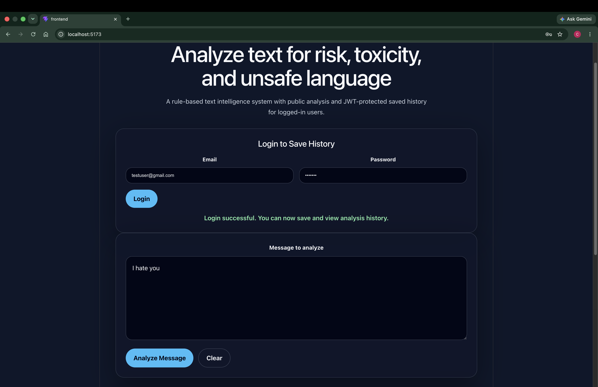
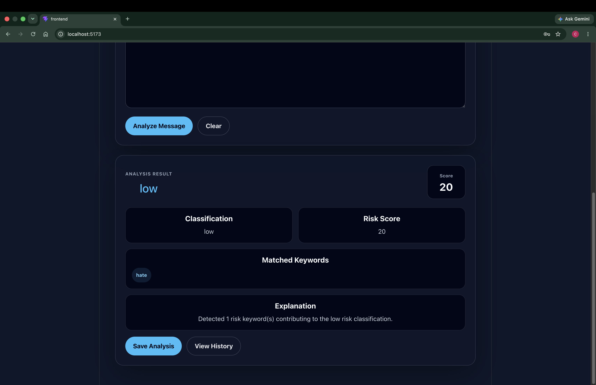
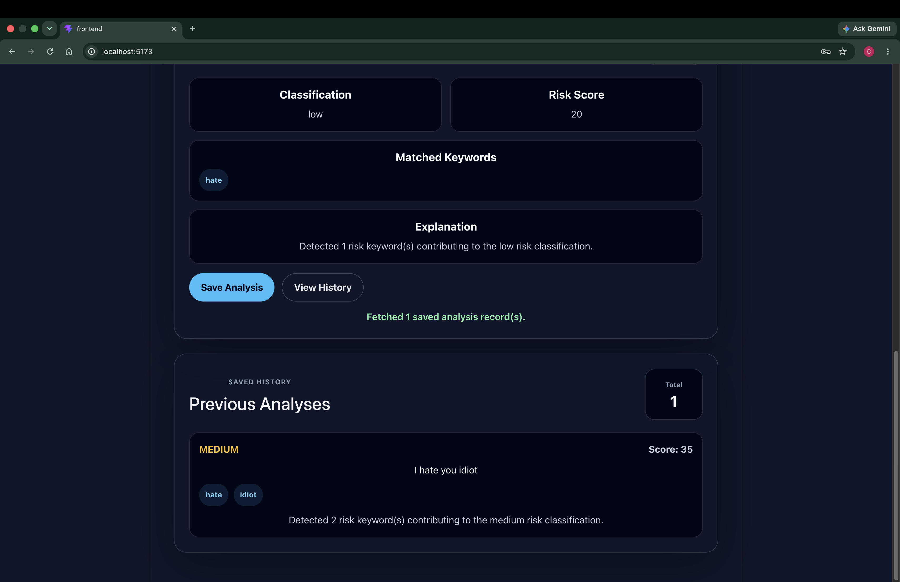

# Message Risk Analyzer — Rule-Based Text Intelligence System

Message Risk Analyzer is a full-stack web application that analyzes user-submitted messages and classifies them into risk levels using deterministic, rule-based scoring logic.

The system is designed to be transparent, explainable, and easy to debug, while also supporting JWT-based authentication for user-specific features such as saved analysis history.

## Preview

### Login

### Analyzer

### Saved History

## Problem

Many platforms need lightweight safety checks on user-generated text without relying only on black-box machine learning models.

This project demonstrates how rule-based systems can be used for:

- Content moderation
- Safety classification
- Explainable decision logic
- User-specific saved analysis history

## Tech Stack

- Frontend: React, Vite, JavaScript, CSS
- Backend: Node.js, Express
- Database: MongoDB
- Auth: JWT, Bcrypt
- APIs: REST

## Features

- Public message risk analysis
- Rule-based scoring engine
- Weighted keyword detection
- Risk classification as safe, low, medium, or high
- Explainable analysis output
- User registration and login
- JWT-protected profile access
- JWT-protected password change
- JWT-protected saved analysis history
- Clean separation between public analysis and private user data

## Architecture

The system follows a modular structure:

- Middleware handles JWT authentication
- Models define user and analysis data
- Services contain isolated risk scoring logic
- Routes handle API request and response flow
- Frontend consumes backend APIs through REST calls

This allows:

- Clear separation of concerns
- Easier debugging
- Reusable scoring logic
- Secure access to user-specific data

## API Overview

### Public Routes

- POST /register — Register a new user
- POST /login — Login and receive JWT token
- POST /analyze — Analyze a message without login

### Protected Routes

- GET /profile — Get logged-in user profile
- PUT /profile — Update logged-in user profile
- PUT /change-password — Change logged-in user password
- POST /history — Save an analysis result
- GET /history — View saved analysis history

## Scoring Logic

Messages are evaluated using:

- Weighted keyword heuristics
- Threshold-based classification
- Deterministic outputs with no randomness
- Matched keyword tracking
- Human-readable explanation output

Example output:

json {   "score": 35,   "risk": "medium",   "matchedKeywords": ["hate", "idiot"],   "explanation": "Detected 2 risk keyword(s) contributing to the medium risk classification." } 

## Authentication Design

The message analyzer is public so users can quickly test text without friction.

JWT authentication is used for private, user-specific features such as:

- Profile access
- Profile updates
- Password changes
- Saving analysis history
- Viewing saved history

This keeps the core analyzer accessible while protecting personal user data.

## Future Improvements

- Add negation handling for messages like “I don’t hate you.”
- Improve context detection beyond simple keyword matching.
- Add saved history filters and delete option for logged-in users.
- Add dashboard insights such as total analyses and high-risk count.

## Status

This project is currently a working full-stack practice project focused on:

- REST API design
- Authentication and authorization
- MongoDB data modeling
- Rule-based text analysis
- Modular backend structure
- Frontend and backend integration